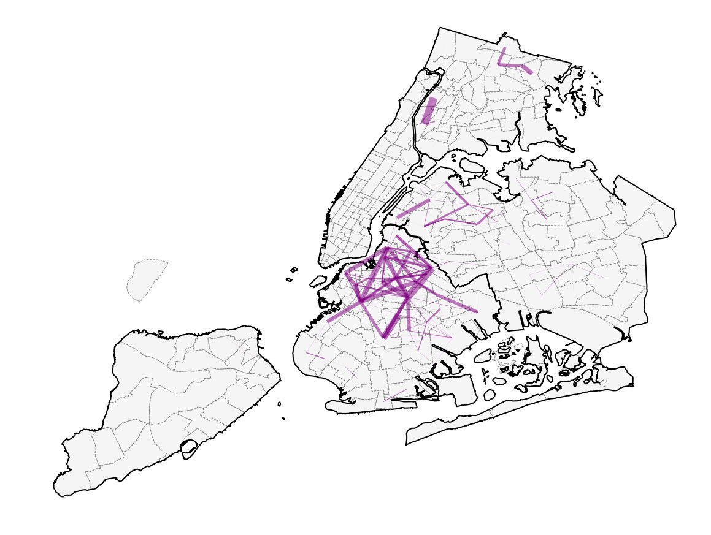

# Capstone 2019 Dollaride Repo

## American Census Survey (ACS) Mapping
- Using folium and ACS API endpoint, we browsed current commuting methods of NYC by census tract.
- acs2017_download.py is the code to download ACS data.
```
$ python acs2017_download.py [ACS ID] # It saves ACS data as ShapeFile.
```
- To plot interactive map, you can use acs_mapper_choropleth.py.
- The method is same as ACS downloading code.
- The map includes driving(alone, carpooled), public transportation(subway, bus, ferry), bicycle, walking, taxi and working at home.


## For Hire Vehicles (FHV)
- NYC OpenData offers yearly FHV data.
- Due to the size of the data, I used Postgresql to minimize memory usage.

Figure. Weekday FHV trip per day between taxi zone in 2018 (over 100)

Figure. Weekend FHV trip per day between taxi zone in 2018 (over 100)

Figure. The number of internal FHV trip

## Route suggestion
- Suggested routes map are in the routes_map directory.
- The methodology is as follows:


## Synthetic Population
- 
-
